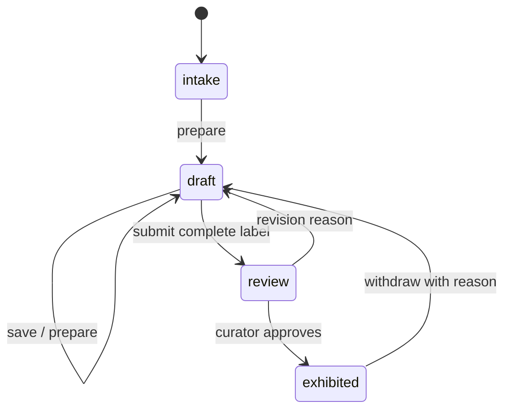

# Afterlight

Independent entry for **Sanity Challenge, Path Two: Vibe-Code Something Strange**.

A fictional future museum of ordinary objects. Inspect original 3D reconstructions, catalogue observable details separately from imagined interpretations, prepare a draft, and require a human decision before exhibition.

## Run It Now

Use Node.js 24 LTS and npm. This folder has no dependency on Path One or a parent workspace.

```sh
npm ci
npm run dev -- --port 3002
```

Open http://localhost:3002. The labelled demo works without credentials and persists changes in this browser. No demo mutation reaches Sanity. The shipped PNGs and fonts are local, so the experience does not depend on stock-image or font services.

Try this complete journey:

1. Inspect the cassette, rotate it, zoom, and download its catalogue record.
2. Open **Curator desk**, then **New object**. Enter a title, reconstruction type, material, and observable details.
3. **Prepare a sample draft**, edit the fictional interpretation and label, then **Save draft**.
4. **Submit for review**, then **Approve & exhibit**. It now appears in **The collection**.
5. Reload to verify persistence. Return the object to draft with a reason; it disappears from the public collection.
6. Open the same record in two tabs and approve it in one. The other detects the changed revision and requires a reload.

The footer's reset control affects only local demo data and requires confirmation. If browser storage is unavailable, editing is not supported; the sample collection remains readable.

## Connect a Separate Sanity Project

The local demo is useful for testing, but **the challenge submission needs an actual Sanity-backed project**. Do not submit it as a verified live integration before completing these steps.

Recommended: run `npm run setup:live` in your own interactive terminal with Node.js 24 active. It guides project creation, hidden token/key entry, safe seeding, schema deployment, activation, and acceptance checks. It writes only this project's private local configuration and does not deploy publicly. `npm run doctor` reports missing setting names without printing credential values.

1. Create an Afterlight project and a `production` dataset at https://www.sanity.io/manage. A **private dataset is recommended** so raw draft content cannot be queried anonymously. The public application exposes only records whose workflow stage is `exhibited`.
2. Create separate project-level read and write tokens. Keep both on the server. The browser never receives a Sanity token.
3. Populate `.env.local` privately in this folder. It is git-ignored. Do not send secrets through chat or include them in recordings.

```dotenv
APP_MODE=live
SANITY_STUDIO_PROJECT_ID=YOUR_PATH_TWO_PROJECT_ID
SANITY_STUDIO_DATASET=production
SANITY_READ_TOKEN=YOUR_PROJECT_VIEWER_TOKEN
SANITY_WRITE_TOKEN=YOUR_PROJECT_EDITOR_TOKEN
CURATOR_ACCESS_CODE=CHOOSE_AN_APP_ONLY_CURATOR_CODE
GOOGLE_GENERATIVE_AI_API_KEY=YOUR_GEMINI_API_KEY
GOOGLE_MODEL=gemini-3.5-flash-lite
APP_URL=http://127.0.0.1:3002
```

4. Seed and inspect the content. The seed is atomic and idempotent: it uses `createIfNotExists` and never overwrites edited records.

```sh
npm run seed
npm run sanity:dev
```

Use your own terminal for any Sanity login. Inspect three collections, eight objects, and their workflow histories. To deploy the schema and run the read preflight:

```sh
npm run sanity:schema
npm run check:live
```

5. Restart the Next.js server. Open the curator desk with the **app-only curator code**, not a Sanity token. Create and move an object through all four stages; confirm the records and `_rev` changes in Studio. Use another tab to check live updates.
6. Configure `GOOGLE_GENERATIVE_AI_API_KEY` for Gemini drafting, use a curator code of at least 24 characters, and set `APP_URL` to the running application's exact origin. `GOOGLE_MODEL` defaults to `gemini-3.5-flash-lite`. Live drafting fails explicitly when the provider key is missing; sample templates are demo-only. Provider failures never substitute a template.

The default read preflight does not verify writes, events, or inference. Run `npm run check:live -- --exercise` to test the real application: it verifies authentication, creates one uniquely named temporary object, uses model drafting, edits it, rejects a stale revision, submits, approves, checks public visibility, withdraws, and deletes its own temporary record. This consumes model quota and briefly exhibits the test object. Cleanup is attempted on failure; if interrupted, inspect only records with that run's unique `Live acceptance` title before deleting anything manually.

The HTTP exercise does not prove SSE delivery. Verify public-gallery refresh in a second browser and inspect the persisted document in Studio. Actual cloud connectivity and hosted deployment remain unverified until these steps run with your credentials.

## Content and Workflow

| Model | Purpose |
| --- | --- |
| `collection` | Named collection and curatorial metadata |
| `artifact` | Collection reference, reconstruction kind, accession, observed material/details, fictional interpretation, label, strangeness, workflow stage |
| `workflowEvent` | Actor class, action, previous/next stage, time, reason; latest 100 events embedded in the artifact |



Automation may prepare a draft, but cannot approve or publish. The server derives the actor from the action; it does not accept an actor field from the browser. Draft text cannot overwrite observable facts. State changes and history are written together with Sanity's `ifRevisionId` precondition. A concurrent edit yields `409 Conflict`, not a last-writer-wins overwrite.

**This is an application-owned workflow stored in Sanity documents.** It does not claim to use the early-access `@sanity/workflow-engine` package or the App SDK. It uses the official Sanity client, revision-guarded mutations, a custom Studio structure, and real-time listeners. This deliberately avoids requiring an early-access entitlement.

The application currently recognizes the three seeded collection IDs and eight reconstruction kinds, with a 100-record catalog read limit. These are a curated challenge scope, not a general-purpose museum CMS. Collection labels/palette are part of the app's fixed registry. Workflow history is bounded, not an immutable compliance audit. A shared curator code identifies an authorized session, not an individual person or a two-person approval policy.

Studio's read-only fields are UI guidance, not dataset access control. A separate writer with broad Sanity credentials can bypass application rules. Restrict direct access appropriately. Exhibited records include their provenance notes; never put secrets or personal information in those notes. The demo's local-storage cross-tab check is best-effort; only Sanity provides atomic revision-guarded writes.

## Live Updates and Safety

The server listens to Sanity with `visibility: query` and sends only a content-change signal over SSE. Clients refetch through the public or authenticated route. No documents or tokens are included in public event notifications. Streams close after 50 seconds and the browser reconnects; a 15-second polling fallback also refreshes data. Use a host that supports streamed responses and 60-second requests.

Writes require a curator code, origin validation, bounded JSON input, schema validation, and a process-local write budget. Set a provider spending cap and hosting/WAF rate limits before public exposure. The process-local limiter is not distributed. For production beyond a challenge demo, replace the shared code with individual identity and role enforcement.

## Verify and Rebuild Assets

```sh
npm test
npm run typecheck
npm run lint
npm run build
npx playwright install chromium
npm run test:e2e
npm audit
```

Browser tests normally start their own server on port 3102. If this project's dev server is already running, use it instead:

```sh
PLAYWRIGHT_BASE_URL=http://127.0.0.1:3002 npm run test:e2e
```

To regenerate the original PNGs from the Three.js models, keep a development server on port 3002 and run:

```sh
node scripts/render-assets.mjs
```

Every generated canvas is checked for visible pixels before capture. The browser tests verify rendered assets, moving 3D content, zoom/reset, desktop/mobile reflow, intake-to-exhibition, withdrawal, persistence, stale editors, dialog focus, and automated accessibility. This is not a complete screen-reader or WCAG-conformance audit.

## Deploy and Submit Independently

Deploy this folder as a separate Next.js application on Vercel or a Node.js 24 host. In a parent repository, set **Root Directory** to `path-2-afterlight`. Build: `npm run build`; Node-host start: `npm start`. Configure secrets in the hosting provider, not in the repository.

Production requires an explicit `APP_MODE`; use `live` with the real service settings. Intentional production-build demonstrations must explicitly select `demo`. After deployment, set your local `APP_URL` to the hosted HTTPS origin and repeat the acceptance exercise there. API keys and curator codes must stay out of the submission ZIP and source repository.

Use [SUBMISSION.md](SUBMISSION.md) for the separate Path Two DEV post and [BUILD_LOG.md](BUILD_LOG.md) for factual build notes. Replace placeholders and add your real live evidence. Include the required `sanitychallenge` tag and **real Sanity project ID**. Provide the judge-only curator code or clear testing instructions, never a Sanity token or Gemini API key. The challenge deadline is **October 4, 2026, 11:59 PM PDT**.

## Sources and Assets

- Challenge: https://dev.to/challenges/sanity-2026-09-16
- Sanity transactions: https://www.sanity.io/docs/content-lake/transactions
- Workflow concepts: https://www.sanity.io/docs/workflows/cookbook
- Original models: `src/lib/objects.ts`; generated images: `public/objects/`.
- Typography: self-hosted DM Sans, DM Serif Display, and IBM Plex Mono through Fontsource. Icons: Lucide.

The model geometry and fictional catalogue copy were authored during this build. No external object photography was used. Dependency overrides patch the same Sanity CLI transitive advisories as Path One; reassess them when updating the upstream packages.
